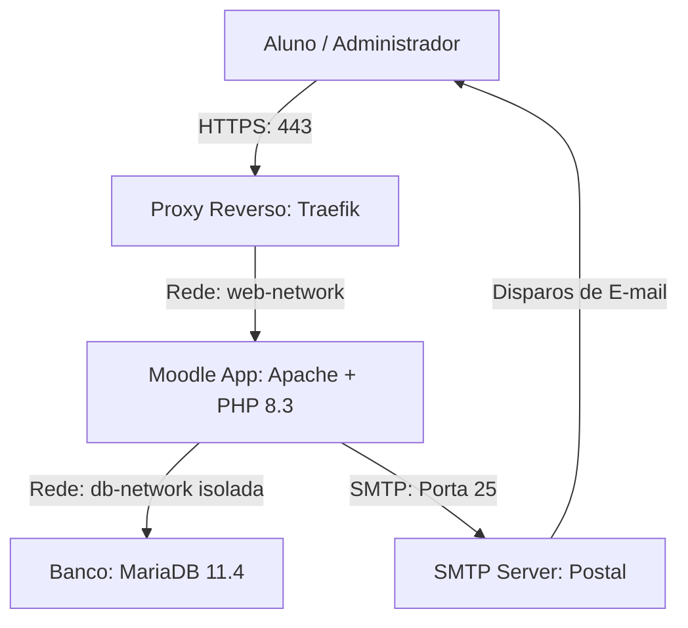

# EAD CDC - Centro de Desenvolvimento e Cidadania


Este diretório contém os códigos-fonte, pacotes compilados e guias arquiteturais para a plataforma de EAD do **CDC**, com o tema customizado **CDC Moodle** (baseado no design premium Uena) e infraestrutura baseada em Docker.

---

## 🗺️ Diagrama de Arquitetura



---

## ⚡ Guia de Inicialização Rápida (Local Staging)

Para subir o ambiente de homologação local em menos de 5 minutos, execute:

```bash
# 1. Configurar variáveis locais
cp docs/ajuda_infra.md .env  # Copie as variáveis exemplificadas e edite o .env

# 2. Iniciar os contêineres Docker
docker compose up -d

# 3. Importar banco de dados de teste (opcional)
gunzip -c backup_db.sql.gz | docker exec -i cdc-moodle-db mariadb -u cdc_moodle_user -p moodle_db
```
Acesse a plataforma em: `http://localhost:8080`

---

## 📂 Árvore de Diretórios do Projeto

```text
cdc_moodle/
├── amd/                # Módulos Javascript assíncronos (AMD) do tema
├── docs/               # Manuais DevOps, Guias de Migração e Políticas
├── lang/               # Dicionários e traduções (pt_br) do tema CDC
├── pix/                # Ativos estáticos, logotipos e imagens do carrossel
├── scss/               # Folhas de estilo (Bootstrap 5 e overrides Uena)
├── templates/          # Arquivos de layout Mustache (Moodle Page Layouts)
├── README.md           # Hub centralizador e documentação geral
├── config.php          # Arquivo de inicialização dinâmica do Moodle
├── lib.php             # Lógica PHP do tema (SCSS assets compilation builder)
└── version.php         # Controle de versão e cacheamento do plugin
```

---

## 📋 Ficha Técnico-Operacional e Requisitos

| Recurso | Mínimo Recomendado | Propósito / Detalhes |
| :--- | :--- | :--- |
| **CPU da VPS** | 2 vCPUs | Processamento de requisições concorrentes e cron do Moodle |
| **Memória RAM** | 4 GB | Prevenção de estouro de memória no PHP-FPM e MariaDB |
| **Armazenamento** | 40 GB SSD | Partição de volume para o diretório `/var/www/moodledata` |
| **Rede** | Docker bridge | Redes isoladas `db-network` (internal) e `web-network` |

---

## ⏱️ Comandos Rápidos de Sobrevivência (Cheat Sheet)

Use estes comandos no terminal da VPS para operações cotidianas de suporte:

* **Limpar Caches do Moodle:**
  ```bash
  docker exec -it cdc-ezpoint_moodle.1.xwi10emrzeha4xhzpmm2sy759 php /var/www/html/admin/cli/purge_caches.php
  ```
* **Validar Compilação do SCSS:**
  ```bash
  # Executa o script CLI de diagnóstico para capturar erros silenciosos de estilos
  docker exec -it cdc-ezpoint_moodle.1.xwi10emrzeha4xhzpmm2sy759 php -r "/* Ver script completo em docs/troubleshooting.md */"
  ```
* **Ler Logs do Servidor Web (Apache):**
  ```bash
  docker logs --tail 100 -f cdc-ezpoint_moodle.1.xwi10emrzeha4xhzpmm2sy759
  ```

---

## 🚀 Guias e Documentação de Infraestrutura e DevOps

Abaixo estão os links para os documentos técnicos detalhados disponíveis no diretório `docs/`:

1. 📂 **[Estratégia de Execução](file:///home/vier/Documentos/Code/Temas/moodle/cdc_moodle/docs/estrategia_execu%C3%A7%C3%A3o.md):** Planejamento de repositórios Git separados para tema e infraestrutura, e o fluxo de testes em ambiente de staging local.
2. 📖 **[Manual de Migração e Auditoria](file:///home/vier/Documentos/Code/Temas/moodle/cdc_moodle/docs/migration_guide.md):** Manual de conexões SSH, comandos Linux de diagnóstico em modo leitura e scripts para download e backup da VPS.
3. 🐳 **[Guia de Infraestrutura e Docker](file:///home/vier/Documentos/Code/Temas/moodle/cdc_moodle/docs/ajuda_infra.md):** Desenho completo da topologia de rede isolada do MariaDB, do arquivo `docker-compose.yml` e modelo de variáveis `.env.example`.
4. 📋 **[Cultura e Template de Post-Mortem](file:///home/vier/Documentos/Code/Temas/moodle/cdc_moodle/docs/postmortem.md):** Diretrizes para análise retrospectiva sem culpa de falhas no servidor e template padrão de relatório de incidentes.
5. 🛠️ **[Manual de Resolução de Problemas (Troubleshooting)](file:///home/vier/Documentos/Code/Temas/moodle/cdc_moodle/docs/troubleshooting.md):** Soluções práticas para permissões de escrita, travamento de charset no banco, depurador de SCSS e portas SMTP do Postal.
6. 💾 **[Política de Backup e Recuperação](file:///home/vier/Documentos/Code/Temas/moodle/cdc_moodle/docs/politica%20de%20BKP.md):** Planejamento de backup 3-2-1, script Bash avançado criptografado via GPG com notificações Discord/Slack e roteiro de restore.
7. 🤖 **[Hub de Contexto e Prompts de IA](file:///home/vier/Documentos/Code/Temas/moodle/cdc_moodle/docs/prompt%20de%20IA.md):** Prompt de System Context e receitas prontas para interações ágeis e co-pilotagem de suporte com Inteligências Artificiais.

---

## 💡 A Importância de Manter a Documentação Viva

Esta documentação foi concebida não apenas como um histórico estático, mas como um **ativo operacional crítico** da equipe de tecnologia do CDC. O Moodle e o Postal rodam sob infraestruturas de microsserviços integradas cuja topologia e segredos técnicos devem permanecer claros. É dever de cada desenvolvedor, engenheiro de DevOps e assistente de inteligência artificial revisar, testar e **atualizar continuamente estes guias** a cada nova atualização de layout, migração de rede ou correção aplicada ao ecossistema, prevenindo retrabalhos e garantindo a continuidade do conhecimento.
