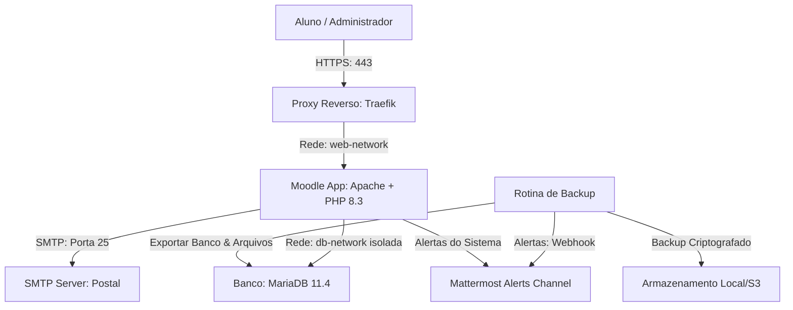

# EAD CDC - Centro de Desenvolvimento e Cidadania


Este diretório contém os códigos-fonte, pacotes compilados e guias arquiteturais para a plataforma de EAD do **CDC**, com o tema customizado **CDC Moodle** (baseado no design premium Uena) e infraestrutura baseada em Docker.

---

## 🗺️ Diagrama de Arquitetura



---

## ⚡ Guia de Inicialização Rápida (Local Staging)

Para subir o ambiente de homologação local em menos de 5 minutos, execute:

```bash
# 1. Configurar variáveis locais
cp docs/ajuda_infra.md .env  # Copie as variáveis exemplificadas e edite o .env

# 2. Iniciar os contêineres Docker
docker compose up -d

# 3. Importar banco de dados de teste (opcional)
gunzip -c backup_db.sql.gz | docker exec -i cdc-moodle-db mariadb -u cdc_moodle_user -p moodle_db
```
Acesse a plataforma em: `http://localhost:8080`

---

## 📂 Árvore de Diretórios do Projeto

```text
cdc_moodle/
├── amd/                # Módulos Javascript assíncronos (AMD) do tema
├── docs/               # Manuais DevOps, Guias de Migração, Backups e Mattermost
├── lang/               # Dicionários e traduções (pt_br) do tema CDC
├── pix/                # Ativos estáticos, logotipos e imagens do carrossel
├── scss/               # Folhas de estilo (Bootstrap 5 e overrides Uena)
├── templates/          # Arquivos de layout Mustache (Moodle Page Layouts)
├── README.md           # Hub centralizador e documentação geral
├── config.php          # Arquivo de inicialização dinâmica do Moodle
├── lib.php             # Lógica PHP do tema (SCSS assets compilation builder)
└── version.php         # Controle de versão e cacheamento do plugin
```

---

## 📋 Ficha Técnico-Operacional e Requisitos

| Recurso | Mínimo Recomendado | Propósito / Detalhes |
| :--- | :--- | :--- |
| **CPU da VPS** | 2 vCPUs | Processamento de requisições concorrentes e cron do Moodle |
| **Memória RAM** | 4 GB | Prevenção de estouro de memória no PHP-FPM e MariaDB |
| **Armazenamento** | 40 GB SSD | Partição de volume para o diretório `/var/www/moodledata` |
| **Rede** | Docker bridge | Redes isoladas `db-network` (internal) e `web-network` |

---

## 🛠️ Configuração do Ambiente e Segredos

O arquivo de variáveis de ambiente `.env` controla as chaves privadas do sistema.
1. Copie o arquivo de exemplo:
   ```bash
   cp .env.example .env
   ```
2. Adicione as chaves reais.
3. **ATENÇÃO:** Nunca commite o arquivo `.env` ou exponha segredos como a URL de webhook do Mattermost (`MATTERMOST_WEBHOOK_URL`) em commits, logs ou mensagens públicas.

---

## ⏱️ Comandos Rápidos de Sobrevivência (Cheat Sheet)

Use estes comandos no terminal da VPS para operações cotidianas de suporte:

* **Limpar Caches do Moodle:**
  ```bash
  docker exec -it cdc-ezpoint_moodle.1.xwi10emrzeha4xhzpmm2sy759 php /var/www/html/admin/cli/purge_caches.php
  ```
* **Validar Compilação do SCSS:**
  ```bash
  # Executa o script CLI de diagnóstico para capturar erros silenciosos de estilos
  docker exec -it cdc-ezpoint_moodle.1.xwi10emrzeha4xhzpmm2sy759 php -r "/* Ver script completo em docs/troubleshooting.md */"
  ```
* **Ler Logs do Servidor Web (Apache):**
  ```bash
  docker logs --tail 100 -f cdc-ezpoint_moodle.1.xwi10emrzeha4xhzpmm2sy759
  ```
* **Testar Webhook do Mattermost:**
  ```bash
  curl --fail --silent --show-error --max-time 10 -X POST -H "Content-Type: application/json" -d '{"text":"Teste de integracao do canal de alertas CDC Moodle concluido."}' "$MATTERMOST_WEBHOOK_URL"
  ```

---

## 🚀 Guias e Documentação de Infraestrutura e DevOps

Abaixo estão os links para os documentos técnicos detalhados disponíveis no diretório `docs/`:

- [Diretrizes de documentação](docs/diretrizes_documentacao.md) — Regras de criação, manutenção, revisão e evolução da documentação.
- [Estratégia de execução](docs/estrategia_execucao.md) — Desenvolvimento, branches, ambientes, releases e implantação.
- [Guia de migração](docs/migration_guide.md) — Acesso seguro, diagnóstico, exportação e migração de ambientes.
- [Ajuda de infraestrutura](docs/ajuda_infra.md) — Containers, redes, portas, DNS, variáveis e Mattermost.
- [Post-mortem](docs/postmortem.md) — Modelo sem culpabilização para análise de incidentes.
- [Troubleshooting](docs/troubleshooting.md) — Diagnóstico e solução de problemas recorrentes.
- [Política de backup](docs/politica_backup.md) — Backup, criptografia, retenção, restauração e alertas no Mattermost.
- [Contexto para IA](docs/prompt_ia.md) — Contexto arquitetural e prompts operacionais para assistentes de IA.

---

## 💡 A Importância de Manter a Documentação Viva

Esta documentação foi concebida não apenas como um histórico estático, mas como um **ativo operacional crítico** da equipe de tecnologia do CDC. O Moodle, o Postal e o Mattermost rodam sob infraestruturas de microsserviços integradas cuja topologia e segredos técnicos devem permanecer claros. É dever de cada desenvolvedor, engenheiro de DevOps e assistente de inteligência artificial revisar, testar e **atualizar continuamente estes guias** a cada nova atualização de layout, migração de rede ou correção aplicada ao ecossistema, prevenindo retrabalhos e garantindo a continuidade do conhecimento.
