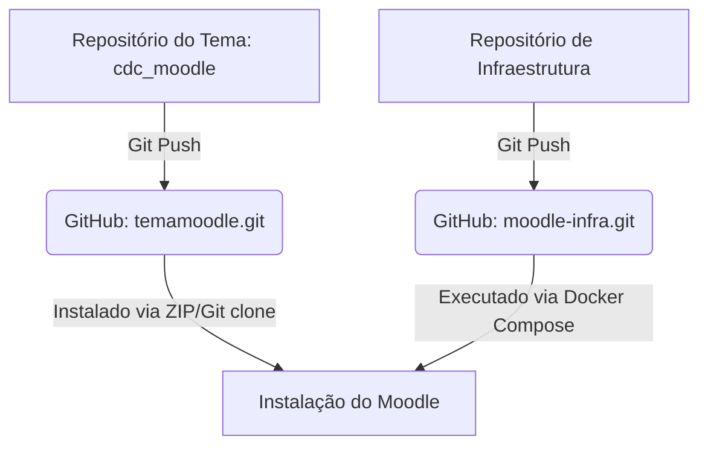

# Estratégia de Execução, Repositórios e Staging - CDC Moodle

Este documento descreve as diretrizes operacionais de controle de versão (Git), fluxo de promoção de código entre ambientes e homologação em laboratório local para o ecossistema do **Centro de Desenvolvimento e Cidadania (CDC)**.

---

## 1. Organização de Repositórios (Separação de Responsabilidades)

Para manter o tema customizado leve, seguro e modular, dividimos o projeto em dois repositórios isolados:



### A. Repositório da Aplicação/Tema (`temamoodle.git`)
* **Propósito:** Contém estritamente o código do tema do Moodle (`cdc_moodle`), incluindo templates Mustache, arquivos de idioma (lang), pastas de ativos de imagem (pix) e estilos (scss).
* **Escopo:** Livre de arquivos de configuração do Docker, dumps de banco de dados ou dados de credenciais da VPS.

### B. Repositório de Infraestrutura (`moodle-infra.git`)
* **Propósito:** Armazena receitas e scripts DevOps utilizados para rodar a aplicação na VPS.
* **Conteúdo:** Arquivos `docker-compose.yml`, configurações de Proxy Reverso (Nginx/Traefik), Dockerfiles de imagem base, scripts de backup (`backup.sh`) e arquivos `.env.example`.

---

## 2. Fluxo de Branches e Promoção de Código

Adotamos uma variação simplificada do GitFlow para garantir estabilidade e testes antes de subir alterações para os alunos:

```
  (main)     -------------------------- [ v1.0.1 ] --------------------> Produção (VPS)
                  ^                  |
                  | (Pull Request)   | (Hotfix Branch)
                  |                  v
(develop)    --- [Homologado] ---- [Erro crítico] --------------------> Local Staging
```

1. **`main`:** Branch estável que espelha exatamente o que está rodando em produção. Alterações diretas nesta branch são estritamente proibidas (exceto hotfixes de produção).
2. **`develop`:** Branch ativa de desenvolvimento. Toda nova funcionalidade, ajuste de cor ou correção de layout deve ser feito a partir dela.
3. **`feature/nome-ajuste`:** Branch temporária para o desenvolvimento de uma tarefa específica. Uma vez concluída e testada localmente, um Pull Request é aberto para a branch `develop`.
4. **`hotfix/correcao-urgente`:** Criada a partir da `main` apenas para corrigir bugs críticos que estão acontecendo em produção. É mesclada diretamente de volta na `main` e na `develop` após homologação.

---

## 3. Homologação em Laboratório Local (Staging)

Toda alteração de tema ou atualização do Moodle deve ser validada localmente antes de ser enviada para a VPS de produção.

### Fluxo de Teste Local:
1. **Clonar e Configurar:** Baixe os repositórios da aplicação e de infraestrutura na sua máquina de desenvolvimento.
2. **Importar Dados Reais:** Importe uma cópia anônima (sem dados sensíveis de alunos) do banco de dados de produção e o diretório `moodledata` para a sua máquina, apontando os caminhos nos volumes locais do Docker.
3. **Configuração de URL:** No arquivo local do Docker Compose, a URL principal do Moodle deve estar configurada para:
   ```env
   MOODLE_WWWROOT=http://localhost:8080
   ```
4. **Validar SCSS e Layout:**
   * Altere as variáveis de cores ou layouts.
   * Force a compilação local de SCSS via CLI (ver guia de `troubleshooting.md`).
   * Navegue pelas páginas críticas (login, cadastro simplificado com wizard de 2 etapas, visualização de cursos e edição de perfil) e garanta que não há erros visuais ou comportamentais.
5. **Aprovação:** Após a validação visual e técnica, faça o merge da feature na branch `develop`, gere a tag de versão e prepare o deploy.
