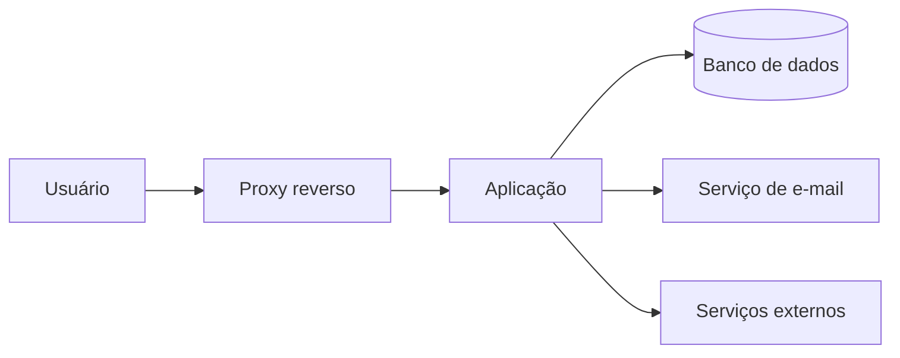

# PROMPT — DOCUMENTAÇÃO PADRONIZADA DE INFRAESTRUTURA, BACKUP E SUPORTE

Este arquivo serve como o modelo de instrução oficial (Prompt) utilizado para gerar a documentação padronizada deste e de outros projetos de DevOps e desenvolvimento na empresa. 

---

## Como usar este Prompt:
Copie todo o conteúdo abaixo e cole ao iniciar uma nova conversa com uma IA assistente (como Gemini Pro, Claude ou ChatGPT) em um novo repositório para gerar automaticamente toda a estrutura documental do projeto.

---

```text
Atue como um Arquiteto de Soluções, Engenheiro DevOps e Especialista em Segurança Sênior.

Sua missão é analisar o projeto atualmente aberto e estruturar, diretamente no diretório local de trabalho, uma documentação técnica completa sobre arquitetura, infraestrutura, implantação, backup, segurança, manutenção e suporte.

A documentação deve ser genérica o suficiente para seguir o padrão organizacional da empresa, mas precisa refletir fielmente as tecnologias, serviços, diretórios, dependências e configurações realmente encontradas neste projeto.

---

## 1. REGRAS GERAIS

Antes de criar ou alterar qualquer arquivo:

1. Analise a estrutura atual do projeto.
2. Identifique automaticamente:
   * Nome do projeto;
   * Linguagens utilizadas;
   * Frameworks;
   * Banco de dados;
   * Serviços externos;
   * Containers existentes;
   * Arquivos Docker;
   * Variáveis de ambiente;
   * Portas utilizadas;
   * Estratégia atual de implantação;
   * Scripts de manutenção;
   * Estrutura de branches, quando identificável;
   * Dependências de infraestrutura.
3. Não invente tecnologias, serviços, portas, domínios ou diretórios.
4. Quando uma informação não puder ser determinada, utilize um marcador explícito como:
   <TODO: DEFINIR>
5. Não sobrescreva informações úteis existentes sem antes incorporá-las à nova documentação.
6. Preserve arquivos já existentes que não façam parte diretamente desta tarefa.
7. Utilize linguagem técnica, clara, objetiva e adequada para:
   * Desenvolvedores;
   * Profissionais de infraestrutura;
   * Equipes de suporte;
   * Administradores de sistemas;
   * Novos integrantes do projeto.
8. Todos os exemplos devem ser executáveis ou facilmente adaptáveis.
9. Não utilize reticências para omitir partes importantes de comandos, scripts ou configurações.
10. Sempre informe claramente quais valores são exemplos e quais foram encontrados no projeto.

---

## 2. ESTRUTURA DE DOCUMENTAÇÃO

Na raiz do projeto, crie a pasta:
docs/

Dentro dela, crie os seguintes sete arquivos:
docs/
├── estrategia_execucao.md
├── migration_guide.md
├── ajuda_infra.md
├── postmortem.md
├── troubleshooting.md
├── politica_backup.md
└── prompt_ia.md

Utilize nomes de arquivos sem espaços e sem caracteres especiais, para evitar problemas de compatibilidade entre sistemas operacionais, URLs, pipelines e ferramentas Git.

---

# 3. CONTEÚDO DOS ARQUIVOS

## 3.1 `docs/estrategia_execucao.md`
Crie um documento descrevendo a estratégia de desenvolvimento, versionamento, homologação e implantação do projeto.
Inclua:
### Visão geral
* Nome e objetivo do projeto;
* Componentes principais;
* Tecnologias utilizadas;
* Ambientes existentes;
* Responsabilidade de cada repositório.

### Organização dos repositórios
Defina ou documente a separação recomendada entre:
* Código da aplicação;
* Infraestrutura;
* Containers;
* Configurações de implantação;
* Scripts operacionais;
* Documentação;
* Recursos específicos de ambiente.
Caso o projeto utilize um único repositório, explique como os componentes devem ser organizados internamente.

### Estratégia de branches
Documente um fluxo contendo, quando aplicável:
* main;
* develop;
* feature/*;
* release/*;
* hotfix/*.
Explique:
* Finalidade de cada branch;
* Regras de merge;
* Pull requests;
* Revisão de código;
* Versionamento;
* Tags de release;
* Procedimento para correções urgentes.

### Ambientes
Documente os ambientes identificados ou recomendados:
* Desenvolvimento;
* Laboratório local;
* Homologação;
* Staging;
* Produção.
Para cada ambiente, informe:
* Objetivo;
* Forma de acesso;
* Porta;
* Banco de dados;
* Origem dos dados;
* Restrições;
* Processo de atualização.
Deixe explícito que dados pessoais e sensíveis não devem ser copiados para ambientes de teste sem anonimização.

### Fluxos funcionais importantes
Documente os principais fluxos funcionais ou assistentes progressivos do sistema.
Para cada fluxo, informe:
* Etapas;
* Arquivos envolvidos;
* Rotas;
* Validações;
* Persistência;
* Tratamento de falhas;
* Critérios de aceite.
Caso não exista um fluxo desse tipo, crie uma seção com:
<TODO: DOCUMENTAR FLUXOS FUNCIONAIS CRÍTICOS>

### Critérios de promoção entre ambientes
Inclua critérios mínimos para promover uma versão entre desenvolvimento, homologação e produção.

---

## 3.2 `docs/migration_guide.md`
Crie um guia de migração, diagnóstico e acesso seguro a servidores.
Inclua:
### Acesso SSH seguro
Documente:
* Geração de chave ED25519;
* Proteção da chave com senha;
* Cópia da chave pública;
* Teste de conexão;
* Permissões corretas dos arquivos;
* Configuração de atalhos no arquivo `~/.ssh/config`;
* Recomendação de desativação de login por senha;
* Recomendação de desativação do acesso direto como `root`;
* Uso de usuário administrativo com `sudo`.
Use placeholders, por exemplo:
<USUARIO_SSH>
<ENDERECO_DO_SERVIDOR>
<PORTA_SSH>
<NOME_DO_HOST>

### Diagnóstico em modo somente leitura
Forneça comandos seguros para verificar:
* Sistema operacional;
* Memória;
* CPU;
* Espaço em disco;
* Inodes;
* Processos;
* Portas abertas;
* Serviços ativos;
* Containers;
* Uso de recursos;
* Redes Docker;
* Volumes;
* Logs recentes;
* Estado do banco de dados.
Priorize comandos que não alterem o servidor.

### Preparação para migração
Inclua checklist para:
* Congelamento de alterações;
* Inventário de serviços;
* Inventário de volumes;
* Exportação de variáveis;
* Registro de versões;
* Backup do banco;
* Backup de arquivos persistentes;
* Validação de espaço;
* Validação de checksums;
* Teste de restauração.

### Exportação do banco de dados
Identifique o banco utilizado pelo projeto e apresente o comando correspondente.
Exemplos podem abranger:
* MySQL ou MariaDB;
* PostgreSQL;
* SQLite;
* MongoDB.
Não inclua senha diretamente na linha de comando. Utilize variáveis de ambiente ou arquivos protegidos.

### Compactação e transferência
Inclua exemplos para:
* tar;
* gzip;
* rsync;
* scp;
* sftp.

### Validação pós-migração
Inclua:
* Teste de integridade;
* Teste das rotas;
* Teste do banco;
* Teste dos serviços externos;
* Teste de tarefas agendadas;
* Teste de e-mail;
* Teste de upload;
* Teste de permissões;
* Plano de rollback.

---

## 3.3 `docs/ajuda_infra.md`
Crie um guia técnico da infraestrutura do projeto.
Inclua:
### Arquitetura atual
Documente:
* Aplicação;
* Proxy reverso;
* Servidor web;
* Runtime;
* Banco de dados;
* Cache;
* Filas;
* Armazenamento;
* Serviços de e-mail;
* Serviços externos;
* Monitoramento;
* Rede.

### Containers
Quando o projeto utilizar Docker, documente um arquivo `docker-compose.yml` de referência coerente com a stack encontrada.
O exemplo deve conter, quando aplicável:
* Aplicação;
* Banco;
* Proxy reverso;
* Volumes persistentes;
* Healthchecks;
* Política de reinicialização;
* Limites ou reservas de recursos;
* Redes públicas e privadas;
* Dependências entre serviços;
* Variáveis de ambiente.
Não substitua automaticamente o arquivo de produção existente, salvo quando isso for explicitamente necessário.

### Isolamento de rede
Explique como separar:
* Rede pública;
* Rede da aplicação;
* Rede interna do banco;
* Serviços que não devem publicar portas no host.
Sempre que possível, configure bancos e serviços internos em redes privadas, sem exposição direta à internet.

### Variáveis de ambiente
Crie ou documente um `.env.example`.
O arquivo deve conter somente:
* Nomes das variáveis;
* Valores fictícios;
* Comentários explicativos;
* Placeholders seguros.
Exemplo:
```env
APP_ENV=development
APP_PORT=8080
DB_HOST=database
DB_PORT=3306
DB_NAME=nome_exemplo
DB_USER=usuario_exemplo
DB_PASSWORD=<DEFINIR_EM_AMBIENTE_SEGURO>
```
Nunca copie valores reais do `.env`.

### DNS e serviços externos
Documente somente os registros pertinentes ao projeto, como:
* A;
* AAAA;
* CNAME;
* MX;
* TXT;
* SPF;
* DKIM;
* DMARC;
* Return-Path;
* Verificação de domínio;
* Subdomínios de aplicação.
Utilize uma tabela com:
| Tipo | Nome | Destino ou valor | TTL | Finalidade |

Não exponha chaves DKIM reais. Use placeholders.

### Portas
Inclua uma tabela:
| Serviço | Porta interna | Porta externa | Protocolo | Exposição |

### Inicialização e encerramento
Documente comandos para:
* Subir os serviços;
* Parar os serviços;
* Reiniciar;
* Reconstruir imagens;
* Verificar status;
* Ler logs;
* Atualizar containers;
* Verificar healthchecks.

---

## 3.4 `docs/postmortem.md`
Crie um documento para orientar a análise de incidentes com cultura blameless, sem procura por culpados.
Explique que o objetivo é:
* Entender o ocorrido;
* Identificar falhas de processo;
* Melhorar controles;
* Reduzir recorrência;
* Compartilhar aprendizado;
* Criar ações preventivas mensuráveis.
Inclua um template completo com:
### Identificação
* Título;
* Número do incidente;
* Data;
* Ambiente;
* Sistemas afetados;
* Responsáveis pela análise;
* Severidade;
* Duração;
* Status.
### Resumo executivo
* O que ocorreu;
* Impacto;
* Período;
* Situação atual.
### Sintomas
* Alertas;
* Erros;
* Comportamentos observados;
* Reclamações recebidas.
### Impacto
* Usuários afetados;
* Serviços indisponíveis;
* Perda ou risco de dados;
* Impacto financeiro;
* Impacto operacional.
### Timeline
Tabela contendo:
| Horário | Evento | Ação | Responsável |
### Detecção
* Como foi detectado;
* Tempo até detecção;
* Alertas existentes;
* Alertas ausentes.
### Resposta
* Ações tomadas;
* Decisões;
* Escalonamentos;
* Comunicação.
### Causa raiz
Utilize a metodologia dos 5 Porquês.
### Fatores contribuintes
* Arquitetura;
* Processo;
* Documentação;
* Monitoramento;
* Permissões;
* Implantação;
* Dependências externas.
### O que funcionou
### O que não funcionou
### Ações corretivas e preventivas
Tabela contendo:
| Ação | Tipo | Prioridade | Responsável | Prazo | Status |
### Lições aprendidas
### Evidências
* Logs;
* Prints;
* Métricas;
* Commits;
* Pull requests;
* Chamados.

---

## 3.5 `docs/troubleshooting.md`
Crie um manual de diagnóstico e resolução de problemas frequentes.
Analise os arquivos e o histórico disponível no repositório para identificar problemas reais ou prováveis.
Organize cada ocorrência com:
* Sintoma;
* Possível causa;
* Diagnóstico;
* Correção;
* Validação;
* Prevenção;
* Comandos relacionados.
Inclua, quando aplicável:
### Containers
* Container reiniciando;
* Imagem incompatível;
* Volume sem permissão;
* Porta ocupada;
* Rede inexistente;
* Healthcheck com falha;
* Variável ausente;
* DNS interno;
* Falta de espaço.
### Permissões
* Usuário correto do serviço;
* Proprietário de diretórios;
* Permissões de escrita;
* Volumes;
* Contextos de segurança;
* SELinux ou AppArmor.
Evite recomendar `chmod 777`.
### Banco de dados
* Conexão recusada;
* Usuário sem permissão;
* Charset;
* Collation;
* Migrações pendentes;
* Timeout;
* Limite de conexões;
* Corrupção;
* Falta de espaço.
### Aplicação
* Cache;
* Sessões;
* Arquivos temporários;
* Compilação de assets;
* CSS ou SCSS;
* JavaScript;
* Rotas;
* Erros HTTP;
* Upload;
* Processos em background.
### Interface
Documente problemas específicos identificados no projeto, como:
* Quebra de layout;
* Elementos desalinhados;
* Responsividade;
* Campos de formulário;
* Ícones;
* CSS conflitante;
* Persistência incorreta no LocalStorage;
* Variáveis JavaScript indefinidas;
* Mesclagem segura de configurações.
### E-mail
Documente:
* Host;
* Porta;
* TLS;
* STARTTLS;
* SSL;
* Autenticação;
* Remetente;
* DNS;
* SPF;
* DKIM;
* DMARC;
* Testes de conectividade.
Não assuma que uma porta específica é correta. Use a configuração encontrada no projeto ou marque como pendente.
### Logs
Inclua comandos para localizar e acompanhar logs sem apagar informações importantes.
### Checklist de emergência
Inclua uma sequência curta e segura para diagnóstico inicial.

---

## 3.6 `docs/politica_backup.md`
Crie uma política completa de backup e restauração.
### Estratégia 3-2-1
Explique:
* Três cópias dos dados;
* Dois tipos de mídia;
* Uma cópia externa ou geograficamente separada.
### Escopo
Documente o backup de:
* Banco de dados;
* Arquivos enviados por usuários;
* Volumes;
* Configurações;
* Arquivos de infraestrutura;
* Certificados, quando aplicável;
* Scripts;
* Tarefas agendadas;
* Metadados necessários para restauração.
Explique também o que não deve ser copiado, como:
* Caches;
* Arquivos temporários;
* Logs descartáveis;
* Dependências reconstruíveis;
* Diretórios gerados automaticamente.
### Frequência
Defina uma recomendação para:
* Backup diário;
* Backup semanal;
* Backup mensal;
* Retenção;
* RPO;
* RTO.
Quando os requisitos não estiverem definidos, use:
<TODO: VALIDAR RPO E RTO COM O RESPONSÁVEL PELO NEGÓCIO>
### Script automatizado
Crie um script Bash de referência que:
1. Carregue configurações de um arquivo externo;
2. Crie diretório temporário seguro;
3. Faça o dump do banco;
4. Compacte arquivos persistentes;
5. Exclua caches e arquivos temporários;
6. Gere checksums SHA-256;
7. Criptografe o pacote;
8. Envie ou mova o backup para o destino configurado;
9. Aplique política de retenção;
10. Registre logs;
11. Envie status para um webhook opcional;
12. Remova arquivos temporários mesmo em caso de falha.
O script deve utilizar:
```bash
set -Eeuo pipefail
```
Também deve possuir tratamento com `trap`.
### Segredos
As chaves, senhas e passphrases devem permanecer em arquivos externos com permissão restrita ou em um gerenciador de segredos.
Exemplo:
.gpg_passphrase
Recomende permissão:
```bash
chmod 600 .gpg_passphrase
```
Nunca inclua uma passphrase real.
### Alertas
Documente integração opcional com:
* Slack;
* Discord;
* Microsoft Teams;
* E-mail;
* System de monitoramento.
Utilize somente placeholders de webhook.
### Restauração
Crie roteiro completo para:
* Preparar ambiente limpo;
* Validar versões;
* Descriptografar;
* Verificar checksum;
* Restaurar arquivos;
* Restaurar banco;
* Corrigir permissões;
* Subir serviços;
* Executar migrações;
* Limpar caches;
* Testar funcionalidades.
### Validação pós-restore
Inclua:
* Integridade do banco;
* Quantidade de registros;
* Login;
* Upload;
* Serviços externos;
* E-mail;
* Tarefas agendadas;
* Logs;
* Performance básica.
### Teste periódico
Recomende restaurações simuladas e registre:
* Data;
* Backup testado;
* Tempo de restauração;
* Resultado;
* Problemas encontrados;
* Responsável.

---

## 3.7 `docs/prompt_ia.md`
Crie um documento de contexto para uso com assistentes de inteligência artificial.
O arquivo deve permitir que uma IA compreenda rapidamente o projeto sem depender de explicações repetidas.
Inclua:
### System Context
Documente:
* Nome do projeto;
* Objetivo;
* Arquitetura;
* Tecnologias;
* Diretórios relevantes;
* Serviços;
* Banco;
* Containers;
* Ambientes;
* Portas;
* Regras de segurança;
* Convenções de código;
* Restrições arquiteturais;
* Decisões técnicas importantes.
### Restrições obrigatórias
Liste restrições específicas encontradas no projeto, por exemplo:
* Não alterar APIs públicas sem compatibilidade;
* Não sobrescrever configurações existentes;
* Não expor segredos;
* Não remover tratamentos de fallback;
* Não quebrar segurança;
* Não alterar nomes de volumes;
* Não modificar portas sem atualizar documentação;
* Não utilizar permissões excessivas;
* Não apagar dados persistentes durante rebuild;
* Preservar compatibilidade com as versões suportadas.
### Regras para respostas da IA
A IA deve:
* Analisar arquivos antes de propor alterações;
* Informar quais arquivos serão alterados;
* Entregar códigos completos;
* Evitar pseudocódigo quando for solicitado código executável;
* Não utilizar reticências para omitir trechos;
* Incluir comandos em linhas completas;
* Preservar recursos existentes;
* Informar riscos;
* Criar rollback;
* Não inventar credenciais;
* Utilizar placeholders;
* Explicar como validar o resultado.
### Prompts rápidos
Crie receitas reutilizáveis para:
* Diagnosticar erro;
* Corrigir container;
* Criar migration;
* Analisar logs;
* Revisar segurança;
* Preparar implantação;
* Criar backup;
* Restaurar backup;
* Melhorar performance;
* Atualizar dependências;
* Criar documentação;
* Analisar incidente;
* Criar plano de rollback;
* Validar configuração de e-mail;
* Revisar permissões;
* Corrigir interface;
* Preparar release.
Cada prompt deve conter:
* Contexto;
* Objetivo;
* Restrições;
* Saída esperada;
* Critérios de validação.

---

# 4. README PRINCIPAL

Na raiz do projeto, crie ou atualize:
README.md

Antes de editar um README existente, preserve e incorpore informações relevantes já documentadas.
O README deve ser conciso, mas suficiente para permitir que um novo integrante compreenda e inicialize o projeto.

## Cabeçalho
Inclua:
* Nome do projeto;
* Descrição resumida;
* Badges Shields.io.
Os badges devem representar, quando aplicável:
* Tecnologia principal;
* Versão;
* Status;
* Ambiente;
* Licença;
* Pipeline;
* Containers;
* Documentação.
Não crie badges que apontem para pipelines ou serviços inexistentes.

## Arquitetura
Adicione um diagrama Mermaid baseado na arquitetura real identificada.
Modelo genérico:

Remova componentes que não existam e adicione os componentes necessários.

## Estrutura de diretórios
Inclua a árvore dos principais diretórios, evitando listar arquivos irrelevantes, dependências instaladas, caches ou arquivos temporários.

## Requisitos mínimos
Adicione uma tabela:
| Componente | Versão mínima | Finalidade |
Inclua apenas componentes efetivamente necessários.

## Inicialização
Documente:
* Clonagem;
* Configuração do `.env`;
* Instalação;
* Build;
* Inicialização;
* Migração;
* Criação de usuário administrativo, quando aplicável;
* Teste de acesso.

## Cheat sheet
Inclua comandos rápidos para:
* Iniciar serviços;
* Parar serviços;
* Reiniciar;
* Reconstruir;
* Ver status;
* Ler logs;
* Limpar cache;
* Executar testes;
* Validar assets;
* Executar migrations;
* Abrir shell da aplicação;
* Acessar banco;
* Criar backup.
Os comandos devem refletir a stack real do projeto.

## Documentação complementar
Adicione links para os sete arquivos.
Prefira links relativos, pois funcionam corretamente no GitHub, GitLab, editores e clones feitos em diretórios diferentes:
```markdown
- [Estratégia de execução](docs/estrategia_execucao.md)
- [Guia de migração](docs/migration_guide.md)
- [Ajuda de infraestrutura](docs/ajuda_infra.md)
- [Post-mortem](docs/postmortem.md)
- [Troubleshooting](docs/troubleshooting.md)
- [Política de backup](docs/politica_backup.md)
- [Contexto para IA](docs/prompt_ia.md)
```
Para cada link, adicione um resumo de uma linha.
Não utilize caminhos file:// fixos como padrão, pois eles deixam de funcionar quando o projeto é clonado em outro computador ou diretório.

### Importância da documentação
Finalize o README com um parágrafo destacando que a documentação deve evoluir junto com:
* Código;
* Infraestrutura;
* Dependências;
* Processos;
* Segurança;
* Decisões arquiteturais.

---

# 5. SEGURANÇA

Faça uma revisão rigorosa de todos os arquivos criados ou alterados.
Verifique a presença de:
* Senhas;
* Tokens;
* Chaves privadas;
* Chaves de API;
* Webhooks reais;
* Credenciais de banco;
* Strings de conexão;
* Cookies;
* Segredos de sessão;
* Certificados privados;
* Domínios internos sensíveis;
* Endereços IP privados que não deveriam ser publicados;
* Dados pessoais;
* Dumps de banco;
* Passphrases.
Utilize somente:
* Variáveis de ambiente;
* Placeholders;
* Valores fictícios;
* Exemplos claramente identificados.

Exemplos de placeholders permitidos:
```text
<APP_SECRET>
<DB_PASSWORD>
<API_TOKEN>
<WEBHOOK_URL>
<SMTP_PASSWORD>
<SSH_HOST>
<DOMINIO_DO_PROJETO>
<ENDERECO_DO_SERVIDOR>
```

Adicione ou atualize o `.gitignore` para proteger, quando aplicável:
```gitignore
.env
.env.*
!.env.example
*.pem
*.key
*.p12
*.pfx
.gpg_passphrase
backups/
dumps/
secrets/
credentials/
```
Não remova regras existentes do `.gitignore`.

---

# 6. VALIDAÇÃO FINAL

Antes de concluir:
1. Confirme que a pasta docs/ foi criada.
2. Confirme que os sete arquivos existem.
3. Confirme que o README.md existe.
4. Confirme que todos os links relativos funcionam.
5. Confirme que os blocos Mermaid possuem sintaxe válida.
6. Confirme que os comandos estão completos.
7. Confirme que os exemplos correspondem à stack identificada.
8. Confirme que nenhuma credencial real foi incluída.
9. Confirme que não existem referências indevidas a outros projetos.
10. Confirme que não foram inventadas configurações.
11. Confirme que os nomes dos arquivos não possuem espaços.
12. Confirme que o conteúdo está salvo em UTF-8.
13. Mostre um resumo das alterações realizadas.
14. Mostre a árvore final dos arquivos criados.
15. Liste eventuais itens marcados com <TODO: DEFINIR>.
16. Informe o resultado da verificação de segurança.

---

# 7. FORMATO DA RESPOSTA FINAL

Após gravar os arquivos diretamente no disco, responda com:
```text
Documentação criada com sucesso.

Arquivos criados ou atualizados:
- README.md
- docs/estrategia_execucao.md
- docs/migration_guide.md
- docs/ajuda_infra.md
- docs/postmortem.md
- docs/troubleshooting.md
- docs/politica_backup.md
- docs/prompt_ia.md

Tecnologias identificadas:
- <LISTAR>

Pendências encontradas:
- <LISTAR OU INFORMAR "Nenhuma">

Verificação de segurança:
- Nenhuma credencial real identificada nos arquivos gerados.
```

Não responda apenas com exemplos do conteúdo. Crie ou atualize efetivamente os arquivos no diretório do projeto.
```
